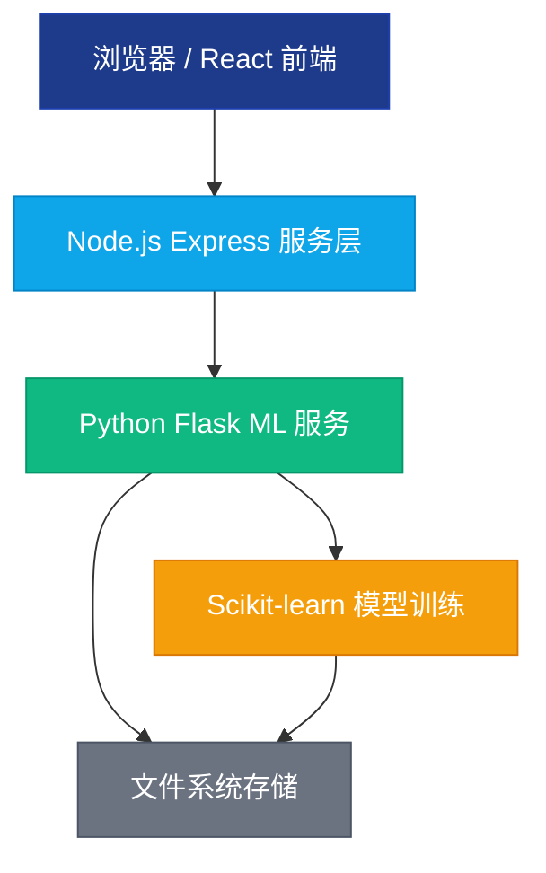
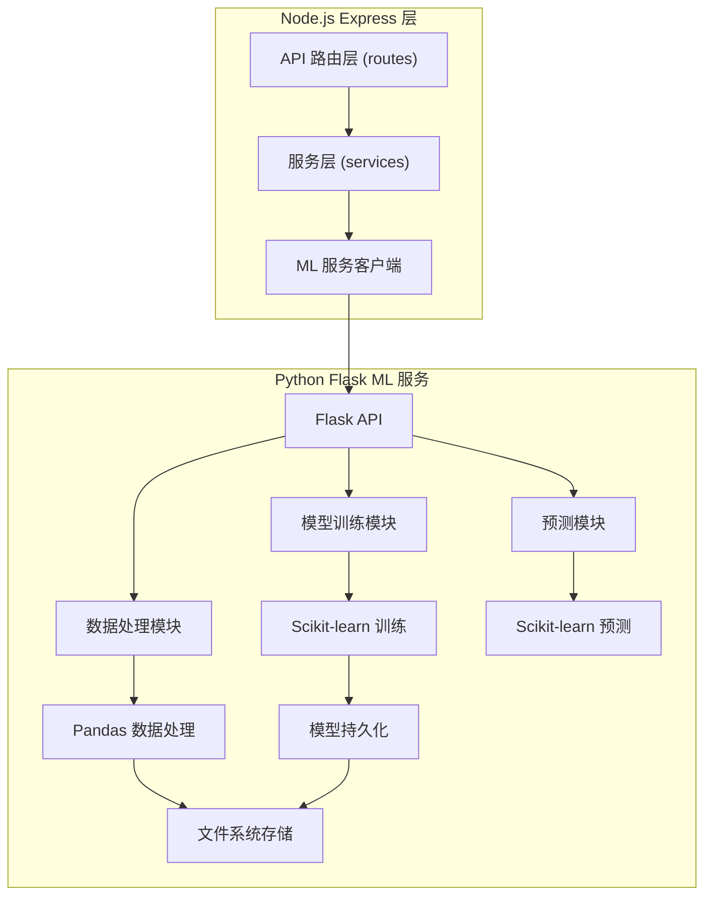
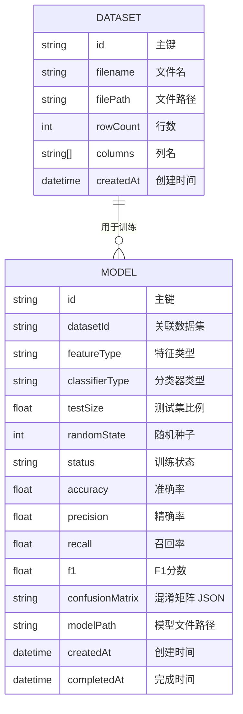

## 1. 架构设计

整体采用前后端分离架构，前端使用 React 提供用户交互界面，Node.js Express 作为 API 网关协调请求，Python Flask 服务负责机器学习模型的训练和预测。



## 2. 技术描述

### 2.1 技术栈
- **前端**：React 18 + TypeScript + Tailwind CSS 3 + Vite
- **API 网关**：Express 4 + TypeScript
- **ML 服务**：Python 3.9 + Flask + Scikit-learn + Pandas + NumPy
- **状态管理**：Zustand
- **路由**：React Router DOM
- **图标**：Lucide React
- **数据可视化**：Recharts

### 2.2 项目初始化
- 使用 `vite-init` 初始化 `react-express-ts` 模板
- 额外创建 Python ML 服务目录结构

### 2.3 目录结构
```
├── src/                    # 前端源码
│   ├── components/         # 可复用组件
│   ├── pages/              # 页面组件
│   ├── hooks/              # 自定义 Hooks
│   ├── store/              # Zustand 状态管理
│   ├── utils/              # 工具函数
│   └── types/              # TypeScript 类型定义
├── api/                    # Node.js Express 后端
│   ├── routes/             # API 路由
│   ├── services/           # 业务逻辑
│   └── types/              # 类型定义
├── ml-service/             # Python ML 服务
│   ├── app.py              # Flask 应用入口
│   ├── models/             # 模型训练与预测逻辑
│   ├── data/               # 上传数据存储
│   └── saved_models/       # 训练好的模型存储
├── shared/                 # 前后端共享类型
└── uploads/                # 文件上传临时目录
```

## 3. 路由定义

### 前端路由
| 路由 | 页面 | 用途 |
|------|------|------|
| / | 首页 | 产品介绍与功能入口 |
| /upload | 数据上传页 | CSV 数据上传与预览 |
| /train | 模型训练页 | 训练配置与模型评估 |
| /predict | 预测页面 | 文本预测与结果展示 |

### 后端 API 路由
| 方法 | 路由 | 用途 |
|------|------|------|
| POST | /api/upload | 上传 CSV 数据文件 |
| GET | /api/datasets | 获取已上传数据集列表 |
| GET | /api/datasets/:id/preview | 获取数据集预览 |
| POST | /api/train | 启动模型训练任务 |
| GET | /api/train/:id/status | 查询训练状态 |
| GET | /api/models/:id/metrics | 获取模型评估指标 |
| POST | /api/predict | 单文本预测 |
| POST | /api/predict/batch | 批量文本预测 |

## 4. API 定义

### 4.1 数据上传
```typescript
// 请求：multipart/form-data
// 字段：file (CSV 文件)

// 响应
interface UploadResponse {
  success: boolean;
  datasetId: string;
  filename: string;
  rowCount: number;
  columns: string[];
  sample: Array<{ text: string; label: string }>;
}
```

### 4.2 训练配置
```typescript
interface TrainConfig {
  datasetId: string;
  featureType: 'tfidf' | 'bow';
  classifierType: 'multinomial' | 'bernoulli';
  testSize: number; // 0.1 - 0.5
  randomState: number;
}

interface TrainResponse {
  success: boolean;
  modelId: string;
  status: 'training' | 'completed' | 'failed';
}

interface TrainStatus {
  modelId: string;
  status: 'training' | 'completed' | 'failed';
  progress: number;
  metrics?: {
    accuracy: number;
    precision: number;
    recall: number;
    f1: number;
    confusionMatrix: number[][];
    labels: string[];
  };
}
```

### 4.3 预测
```typescript
interface PredictRequest {
  modelId: string;
  text: string;
}

interface PredictResponse {
  success: boolean;
  predictedLabel: string;
  confidence: number;
  topK: Array<{ label: string; probability: number }>;
}
```

## 5. 服务器架构图



## 6. 数据模型

### 6.1 数据模型定义



### 6.2 数据存储说明
- **数据集文件**：存储在 `ml-service/data/` 目录，以 `{datasetId}.csv` 命名
- **训练好的模型**：使用 joblib 序列化，存储在 `ml-service/saved_models/` 目录，以 `{modelId}.joblib` 命名
- **向量器**：与模型一同保存，命名为 `{modelId}-vectorizer.joblib`
- **元数据**：使用 JSON 文件存储数据集和模型的元信息，便于快速查询
