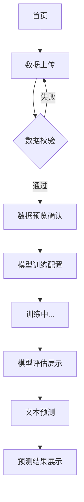

## 1. 产品概述

基于 Python + Scikit-learn 的文本分类服务平台，支持用户上传带标签的文本数据，训练朴素贝叶斯分类器，并对新文本进行类别预测。

- **主要用途**：为数据分析人员和机器学习初学者提供易用的文本分类模型训练与预测工具
- **解决问题**：降低文本分类任务的技术门槛，无需编写代码即可完成模型训练和预测
- **目标用户**：数据分析师、机器学习学习者、NLP 从业者
- **产品价值**：提供可视化、交互式的文本分类全流程体验

## 2. 核心功能

### 2.1 用户角色
| 角色 | 注册方式 | 核心权限 |
|------|---------|----------|
| 普通用户 | 无需注册，直接使用 | 上传数据、训练模型、预测文本、查看结果 |

### 2.2 功能模块
1. **首页**：导航、产品介绍、快速入口
2. **数据上传页**：CSV 文件上传、数据预览、格式校验
3. **模型训练页**：训练参数配置、训练进度、模型评估指标展示
4. **预测页面**：单文本/批量文本预测、预测结果展示、历史记录

### 2.3 页面详情
| 页面名称 | 模块名称 | 功能描述 |
|---------|----------|----------|
| 首页 | Hero 区域 | 产品介绍、核心特性展示、快速开始按钮 |
| 首页 | 功能卡片 | 数据上传、模型训练、文本预测三大核心功能入口 |
| 数据上传页 | 上传区域 | 拖拽或点击上传 CSV 文件，支持格式说明 |
| 数据上传页 | 数据预览 | 表格展示上传数据的前 N 行，显示列名和样本数量 |
| 数据上传页 | 格式校验 | 检查 CSV 是否包含 text 和 label 列，提示错误信息 |
| 模型训练页 | 参数配置 | 选择特征提取方式（TF-IDF/词袋）、朴素贝叶斯类型（Multinomial/Bernoulli） |
| 模型训练页 | 训练控制 | 开始训练、暂停、重置，训练进度条展示 |
| 模型训练页 | 评估结果 | 准确率、精确率、召回率、F1 分数、混淆矩阵可视化 |
| 预测页面 | 文本输入 | 单文本输入框，支持多行文本 |
| 预测页面 | 预测结果 | 显示预测类别、置信度、Top-K 候选类别 |
| 预测页面 | 批量预测 | 支持批量文本输入，返回批量预测结果 |

## 3. 核心流程

用户从首页进入，首先上传带标签的 CSV 文本数据，系统校验数据格式并展示预览；用户确认数据无误后进入训练页面，配置模型参数并启动训练；训练完成后展示模型评估指标；最后进入预测页面，输入新文本进行分类预测。

## 4. 用户界面设计

### 4.1 设计风格
- **主色调**：深靛蓝 (#1e3a8a)，代表专业、科技感
- **辅助色**：翠绿色 (#10b981)，用于成功状态和重点操作；橙红色 (#f97316)，用于警告和错误
- **中性色**：石板灰系列，用于背景、文字和边框
- **按钮风格**：圆角 8px，带有微妙阴影，悬停时有上浮动画
- **字体**：标题使用 'Space Grotesk' 无衬线字体，正文使用 'Inter' 字体
- **布局风格**：卡片式布局，顶部导航栏，内容区居中对齐
- **图标风格**：使用 lucide-react 线性图标，保持简洁统一

### 4.2 页面设计概述
| 页面名称 | 模块名称 | UI 元素 |
|---------|----------|----------|
| 首页 | Hero 区域 | 大标题 + 副标题，渐变背景，动画按钮 |
| 首页 | 功能卡片 | 三栏等分布局，图标 + 标题 + 描述，悬停动效 |
| 数据上传页 | 上传区域 | 虚线边框区域，拖拽高亮，图标动画 |
| 数据上传页 | 数据预览 | 可滚动表格，斑马纹，列名高亮 |
| 模型训练页 | 训练进度 | 进度条动画，步骤指示器 |
| 模型训练页 | 评估指标 | 指标卡片网格，数值动画，混淆矩阵热力图 |
| 预测页面 | 结果展示 | 类别标签，置信度进度条，平滑过渡动画 |

### 4.3 响应式
- **桌面优先**设计，主要适配 1280px 及以上宽度
- **平板适配**：两栏布局，卡片宽度自适应
- **移动端**：单栏布局，导航折叠，表格横向滚动
- **触摸优化**：按钮最小高度 44px，输入框足够间距

### 4.4 动效设计
- **页面加载**：元素渐入 + 轻微上浮，错开延迟
- **按钮交互**：悬停时背景色渐变 + 轻微放大，点击时收缩反馈
- **数据上传**：拖拽进入时边框高亮，上传成功后绿色打勾动画
- **训练进度**：进度条平滑增长，完成时庆祝动效
- **预测结果**：结果卡片从下往上滑入，置信度条动画填充
